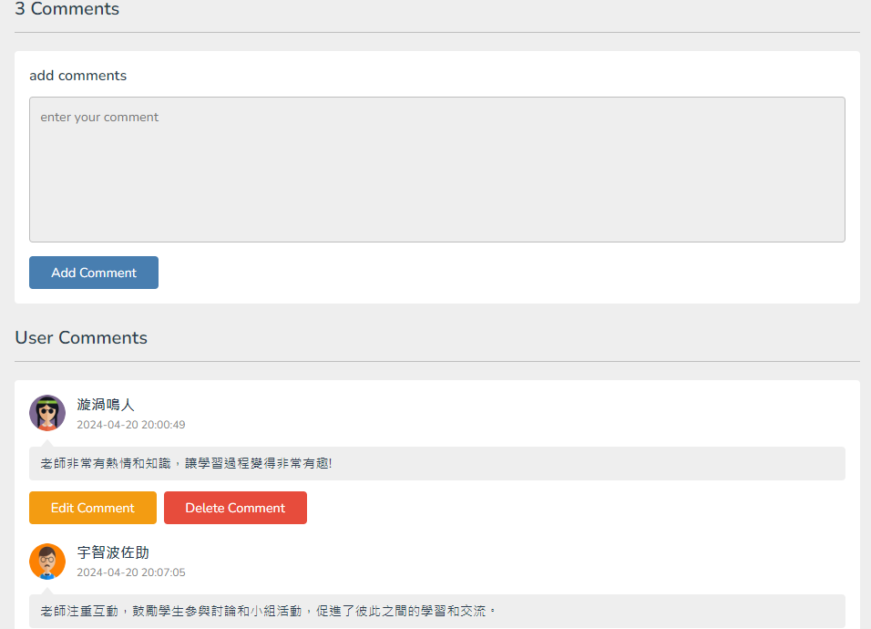

# 📚 課程評價網頁

一個幫助大學生快速了解各門課程評價的網站，提供清楚的課程資訊與互動式評價功能，解決網路資訊分散與不一致的問題。

---

## 📌 專案特色
- 提供學生針對課程進行多面向評價：課程難度、考試難度、給分甜度、私心推薦、留言回饋。
- 支援註冊、登入、評價功能與新增課程。
- 動態顯示各系所課程的綜合數據，並使用 Circular Progress Bar 呈現統計結果，更加直觀。
- 全站採用 PHP + MySQL 實作後端邏輯，前端則使用 HTML、CSS、JavaScript 建構互動介面。

---

## 🔧 使用技術與工具

| 類別     | 技術/工具              |
|----------|-------------------------|
| 語言     | HTML、CSS、JavaScript、PHP |
| 資料庫   | MySQL                   |
| 開發工具 | Visual Studio Code、XAMPP |

---
## 📷 畫面展示

- 課堂選擇畫面 
  
- 課堂評價資訊 
  
- 留言畫面，可以編輯或是刪除留言 
  
- 課堂評價畫面 
  
- 登入、登出 
  
---

